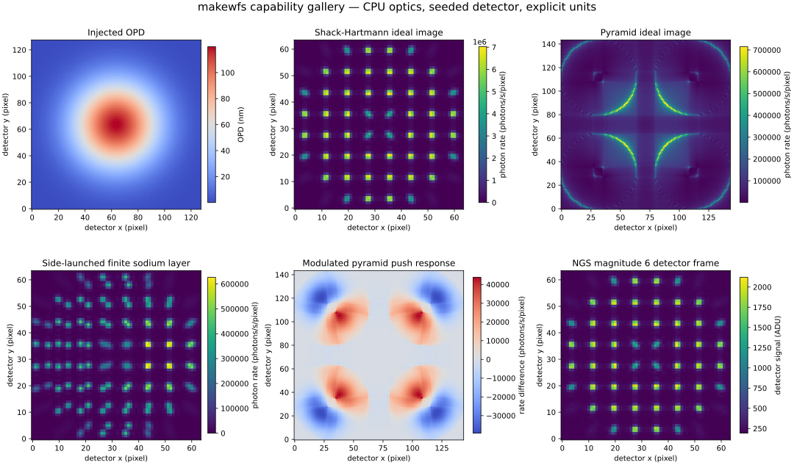

# Documentation gallery

This versioned gallery is generated by `examples/gallery.py` from shipped TOML
configurations. Every panel includes a color bar, physical units, axis labels,
and a caption describing whether it is an ideal photon-rate map, a rate
difference, or a noisy detector ADU frame.



The accompanying [manifest](gallery/makewfs-gallery.json) records the seed,
configuration paths, normalized configuration digests, units, and explicit LGS
and pyramid modeling notes. Regenerate it with:

```bash
MPLBACKEND=Agg python examples/gallery.py \
  --output docs/gallery/makewfs-gallery.svg \
  --manifest docs/gallery/makewfs-gallery.json
```
